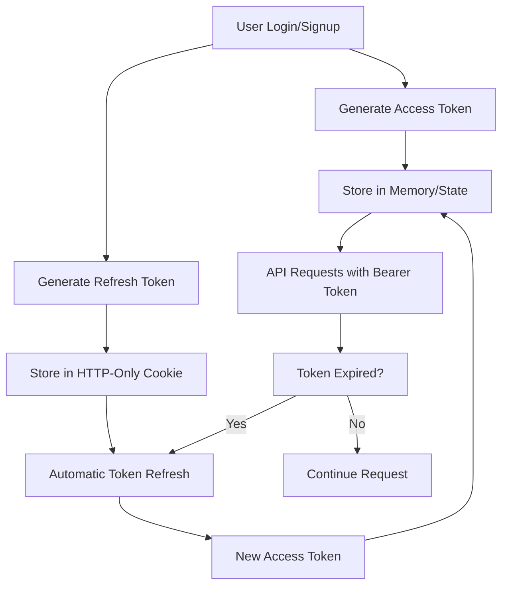
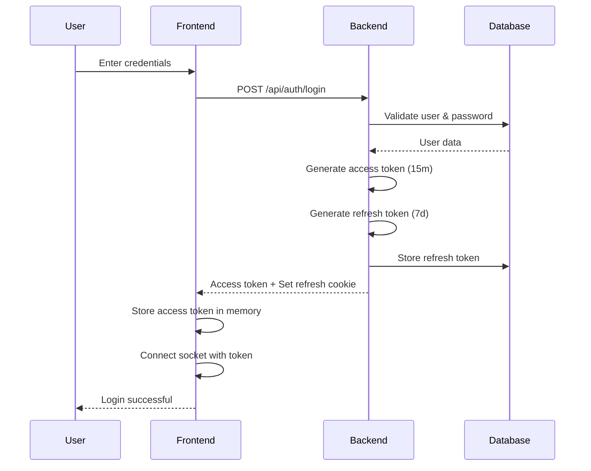
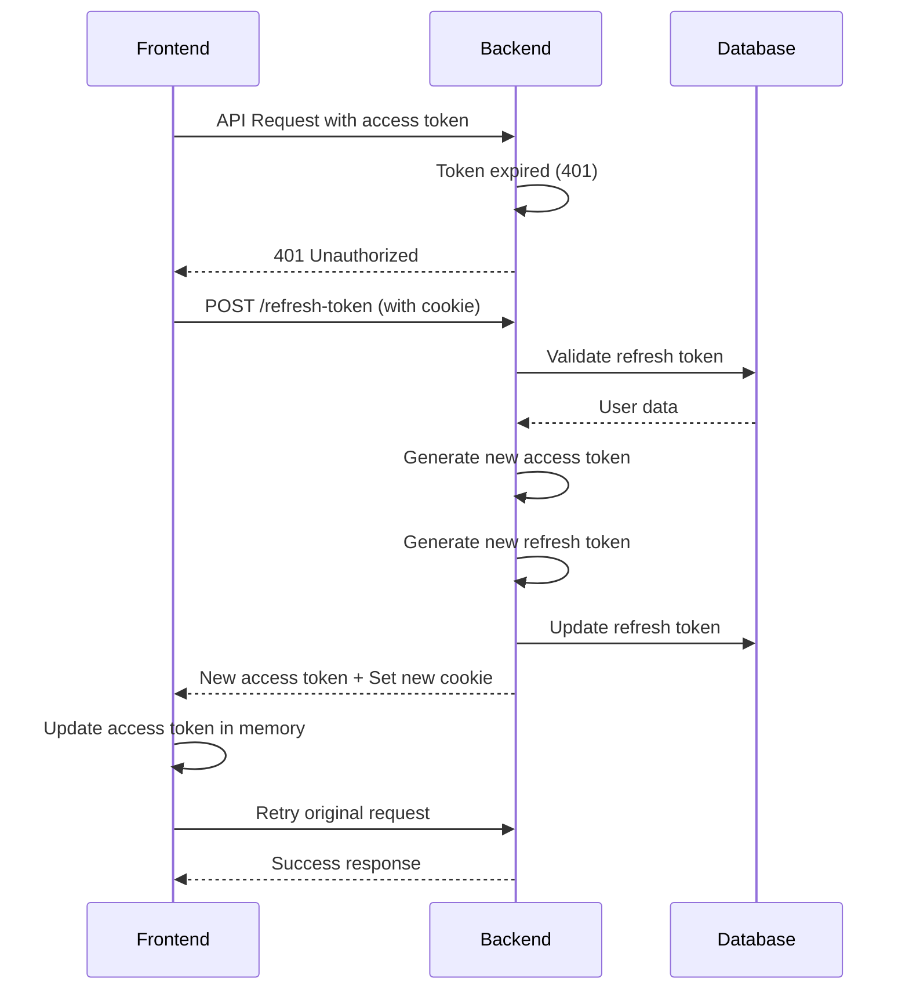
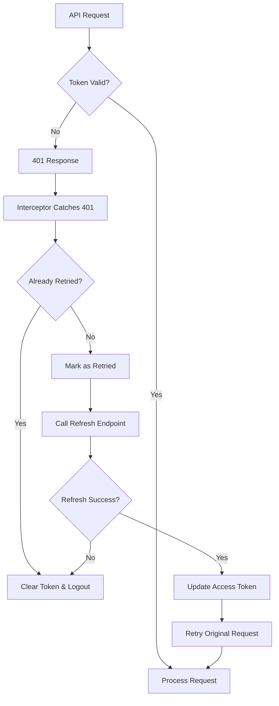

# Token Authentication System - Detailed Documentation

## Overview

This chat application implements a secure JWT-based authentication system using **Access Tokens** and **Refresh Tokens** to ensure secure user sessions and automatic token renewal. The system is designed with security best practices including token expiration, automatic refresh, and secure cookie handling.

## Table of Contents

1. [Architecture Overview](#architecture-overview)
2. [Token Types and Purpose](#token-types-and-purpose)
3. [Backend Implementation](#backend-implementation)
4. [Frontend Implementation](#frontend-implementation)
5. [Token Flow Diagrams](#token-flow-diagrams)
6. [Security Features](#security-features)
7. [Environment Variables](#environment-variables)
8. [Error Handling](#error-handling)
9. [Best Practices](#best-practices)

---

## Architecture Overview

The authentication system follows a **dual-token approach**:

- **Access Token**: Short-lived (default 15 minutes, configurable) for API authentication
- **Refresh Token**: Long-lived (default 7 days, configurable) stored securely in HTTP-only cookies
- **Automatic Token Refresh**: Seamless token renewal without user intervention
- **Socket Authentication**: Real-time connections authenticated with JWT tokens



---

## Token Types and Purpose

### Access Token
- **Purpose**: Authenticate API requests
- **Lifetime**: 15 minutes by default (configurable via `ACCESS_TOKEN_EXPIRY`, e.g., `5m` in production)
- **Storage**: In-memory (frontend state)
- **Security**: Short-lived to minimize security risks
- **Usage**: Included in `Authorization: Bearer <token>` header

### Refresh Token
- **Purpose**: Generate new access tokens without re-authentication
- **Lifetime**: 7 days by default (configurable via `REFRESH_TOKEN_EXPIRY`)
- **Storage**: HTTP-only cookie (secure, not accessible via JavaScript)
- **Security**: Long-lived but stored securely
- **Usage**: Automatically sent with requests to `/refresh-token` endpoint

---

## Backend Implementation

### 1. Token Generation (`backend/lib/util.js`)

```javascript
import jwt from "jsonwebtoken";

// Generate short-lived access token
export const generateToken = (id) => {
    const token = jwt.sign(
        {id}, 
        process.env.JWT_SECRET_KEY, 
        {expiresIn: process.env.ACCESS_TOKEN_EXPIRY || "15m"}
    );
    return token;
}

// Generate long-lived refresh token
export const generateRefreshToken = (id) => {
    const token = jwt.sign(
        {id}, 
        process.env.JWT_REFRESH_SECRET_KEY, 
        {expiresIn: process.env.REFRESH_TOKEN_EXPIRY || "7d"}
    );
    return token;
}
```

**Why this approach?**
- **Separation of Secrets**: Different secret keys for access and refresh tokens
- **Configurable Expiry**: Environment-based token lifetimes
- **Minimal Payload**: Only user ID in token payload for security
- **JWT Standard**: Industry-standard token format with built-in expiration

### 2. User Model (`backend/models/user-model.js`)

```javascript
const UserSchema = new mongoose.Schema({
    // ... other fields
    refreshToken: {
        type: String,
        select: false,  // Not included in queries by default
        default: null,
    }
}, { strict: false }, { timestamps: true });
```

**Why store refresh tokens in database?**
- **Token Invalidation**: Ability to revoke tokens on logout/security breach
- **Single Session**: Only one valid refresh token per user at a time
- **Security Audit**: Track token usage and detect anomalies
- **Select: false**: Refresh tokens not exposed in normal queries

### 3. Authentication Middleware (`backend/middlewares/auth.js`)

```javascript
export const verifyToken = async (req, res, next) => {
    try {
        // Extract token from Authorization header
        const token = req.headers?.authorization?.split(" ")[1];
        if (!token) {
            return res.status(401).json({ message: "Access Token required" });
        }
        
        // Verify token signature and expiration
        const decoded = jwt.verify(token, process.env.JWT_SECRET_KEY);
        if (!decoded) {
            return res.status(401).json({ message: "Invalid access token" });
        }
        
        // Verify user still exists
        const user = await User.findById(decoded.id);
        if (!user) {
            return res.status(401).json({ message: "User not found" });
        }
        
        // Attach user to request object
        req.user = user;
        next();
    } catch (error) {
        // Handle specific JWT errors
        if(error.name === 'TokenExpiredError'){
            return res.status(401).json({ message: "Token expired" });
        } else if(error.name === 'JsonWebTokenError'){
            return res.status(401).json({ message: "Invalid token" });
        }
        console.log("Auth error:", error);
        res.status(500).json({ message: "Internal server error" });
    }
}
```

**Security Features:**
- **Token Validation**: Verifies signature, expiration, and user existence
- **Error Handling**: Specific error messages for different failure types
- **User Verification**: Ensures user account still exists
- **Request Enhancement**: Adds user object to request for downstream handlers

### 4. User Controllers - Login/Signup (`backend/controllers/user-controllers.js`)

#### Login Implementation
```javascript
export const login = async (req, res) => {
    const { email, password } = req.body;
    try {
        // Validate input
        if (!email || !password) {
            return res.status(400).json({ message: "All fields are required" });
        }
        
        // Find user with password field
        const user = await User.findOne({ email }).select("+password");
        if (!user) {
            return res.status(400).json({ message: "Invalid credentials" });
        }
        
        // Verify password
        const isPasswordCorrect = await bcrypt.compare(password, user.password);
        if (!isPasswordCorrect) {
            return res.status(400).json({ message: "Invalid credentials" });
        }

        // Remove password from response
        const { password: _, ...userWithoutPassword } = user.toObject();
        
        // Generate tokens
        const accessToken = generateToken(user._id);
        const refreshToken = generateRefreshToken(user._id);
        
        // Store refresh token in database
        user.refreshToken = refreshToken;
        await user.save();
        
        // Set secure HTTP-only cookie
        res.cookie('refreshToken', refreshToken, {
            httpOnly: true,        // Not accessible via JavaScript
            sameSite: 'strict',    // Good for same-site; use 'none' for cross-site setups
            secure: process.env.NODE_ENV === 'production', // HTTPS only in production
            maxAge: 7 * 24 * 60 * 60 * 1000 // 7 days
        });
        
        // Return access token and user data
        res.status(200).json({ 
            success: true, 
            message: "User logged in successfully", 
            userData: userWithoutPassword, 
            token: accessToken 
        });
    } catch (error) {
        console.log("Login error:", error);
        res.status(500).json({ message: "Internal server error" });
    }
}
```

**Key Security Features:**
- **Password Hashing**: bcrypt for secure password storage
- **Selective Field Query**: `.select("+password")` to include normally excluded password field
- **Password Exclusion**: Remove password from response object
- **Secure Cookies**: HTTP-only, SameSite, secure flags
- **Token Storage**: Refresh token stored in database for invalidation capability

#### Signup Implementation
```javascript
export const signup = async (req, res) => {
    const { fullName, email, password, profilePic, bio } = req.body;
    try {
        // Validate required fields
        if (!fullName || !email || !password) {
            return res.status(400).json({ message: "All fields are required" });
        }
        
        // Check if user already exists
        const user = await User.findOne({ email });
        if (user) {
            return res.status(400).json({ message: "User already exists" });
        }
        
        // Hash password with salt
        const salt = await bcrypt.genSalt(10);
        const hashedPassword = await bcrypt.hash(password, salt);
        
        // Create new user
        const newUser = await User.create({ 
            fullName, 
            email, 
            password: hashedPassword, 
            profilePic, 
            bio 
        });

        // Generate tokens immediately after signup
        const accessToken = generateToken(newUser._id);
        const refreshToken = generateRefreshToken(newUser._id);
        
        // Store refresh token
        newUser.refreshToken = refreshToken;
        await newUser.save();
        
        // Set secure cookie
        res.cookie('refreshToken', refreshToken, {
            httpOnly: true,
            sameSite: 'strict',
            secure: process.env.NODE_ENV === 'production',
            maxAge: 7 * 24 * 60 * 60 * 1000
        });
        
        res.status(201).json({ 
            success: true, 
            message: "User created successfully", 
            userData: newUser, 
            token: accessToken 
        });
    } catch (error) {
        console.log("Signup error:", error);
        res.status(500).json({ message: "Internal Server Error" });
    }
}
```

**Signup Security Features:**
- **Password Hashing**: bcrypt with salt for secure storage
- **Duplicate Prevention**: Check for existing email before creation
- **Immediate Authentication**: Auto-login after successful signup
- **Consistent Token Handling**: Same security measures as login

### 5. Token Refresh Endpoint

```javascript
export const refreshToken = async (req, res) => {
    try {
        // Extract refresh token from cookie
        const refreshToken = req.cookies.refreshToken;
        if (!refreshToken) {
            return res.status(401).json({ 
                success: false, 
                message: "No refresh token provided" 
            });
        }

        // Verify refresh token
        const decoded = jwt.verify(refreshToken, process.env.JWT_REFRESH_SECRET_KEY);
        const user = await User.findById(decoded.id).select("+refreshToken");

        // Validate token matches stored token
        if (!user || user.refreshToken !== refreshToken) {
            // Invalidate all tokens for security
            await User.findByIdAndUpdate(decoded.id, { refreshToken: null });
            return res.status(401).json({ 
                success: false, 
                message: "Invalid refresh token" 
            });
        }

        // Generate new token pair
        const newAccessToken = generateToken(user._id);
        const newRefreshToken = generateRefreshToken(user._id);
        
        // Update stored refresh token
        user.refreshToken = newRefreshToken;
        await user.save();

        // Set new refresh token cookie
        res.cookie('refreshToken', newRefreshToken, {
            httpOnly: true,
            sameSite: 'strict',
            secure: process.env.NODE_ENV === 'production',
            maxAge: 7 * 24 * 60 * 60 * 1000
        });

        // Remove sensitive data from response
        const { password, refreshToken: _, ...userWithoutPassword } = user.toObject();

        res.status(200).json({
            success: true,
            message: "Token refreshed successfully",
            token: newAccessToken,
            userData: userWithoutPassword
        });
    } catch (error) {
        console.log("Refresh token error:", error);
        res.status(401).json({ 
            success: false, 
            message: "Invalid refresh token" 
        });
    }
}
```

**Refresh Token Security:**
- **Cookie-based**: Refresh token only accessible via HTTP-only cookie
- **Token Rotation**: New refresh token generated on each refresh
- **Database Validation**: Verify stored token matches provided token
- **Automatic Invalidation**: Invalid tokens trigger complete token revocation
- **Data Sanitization**: Remove sensitive fields from response

### 6. Logout Implementation

```javascript
export const logout = async (req, res) => {
    try {
        const userId = req.user._id;
        if (!userId) {
            return res.status(400).json({ 
                success: false, 
                message: "User ID not found in request" 
            });
        }
        
        // Invalidate refresh token in database
        await User.findByIdAndUpdate(userId, { refreshToken: null });
        
        // Clear refresh token cookie
        res.clearCookie('refreshToken', {
            httpOnly: true,
            sameSite: 'strict',
            secure: process.env.NODE_ENV === 'production'
        });
        
        res.status(200).json({ 
            success: true, 
            message: "User logged out successfully" 
        });
    } catch (error) {
        console.log("Logout error:", error);
        res.status(500).json({ 
            success: false, 
            message: "Internal server error" 
        });
    }
};
```

**Logout Security:**
- **Token Invalidation**: Remove refresh token from database
- **Cookie Clearing**: Clear HTTP-only cookie on client
- **Complete Session Termination**: Ensures no further token refresh possible

Note: Logout endpoint is protected (requires a valid access token via `verifyToken`).

### 7. Socket Authentication (`backend/middlewares/auth.js`)

```javascript
export const verifySocket = async (socket, next) => {
    try {
        // Get token from auth payload or query params
        const token = socket.handshake.auth?.token || socket.handshake.query?.token;

        if (!token) {
            console.log("Socket connection rejected: No token provided");
            return next(new Error("Authentication error: No token provided"));
        }

        // Verify JWT token
        const decoded = jwt.verify(token, process.env.JWT_SECRET_KEY);
        if (!decoded) {
            console.log("Socket connection rejected: Invalid token");
            return next(new Error("Authentication error: Invalid token"));
        }

        // Get user from database
        const user = await User.findById(decoded.id);
        if (!user) {
            console.log("Socket connection rejected: User not found");
            return next(new Error("Authentication error: User not found"));
        }

        // Attach user info to socket
        socket.userId = user._id.toString();
        socket.user = user;
        console.log(`Socket authenticated for user: ${user.fullName} (${user._id})`);
        next();
    } catch (error) {
        console.log("Socket authentication error:", error.message);
        next(new Error("Authentication error: " + error.message));
    }
}
```

**Socket Security Features:**
- **JWT Authentication**: Same token validation as HTTP requests
- **Multiple Token Sources**: Support for auth payload and query parameters
- **User Association**: Attach user data to socket for real-time features
- **Error Handling**: Detailed logging for security monitoring

---

## Frontend Implementation

### 1. Axios Instance Configuration (`frontend/src/lib/axiosInstance.js`)

```javascript
import axios from "axios";

const backendURL = import.meta.env.VITE_BACKEND_URL;

// Create axios instance with base configuration
const axiosInstance = axios.create({
    baseURL: backendURL,
    withCredentials: true,  // Enable cookie sending
});

// Token management
let currentAccessToken = null;
let tokenRefreshFail = null; // optional global cleanup callback

// Set access token in memory and axios headers
export const setAccessToken = (token) => {
    currentAccessToken = token;
    axiosInstance.defaults.headers.common["Authorization"] = token ? `Bearer ${token}` : undefined;
};

// Get current access token
export const getAccessToken = () => currentAccessToken;

// Allow app to register a callback when refresh fails (e.g., to disconnect socket and clear state)
export const setTokenRefreshFailCallback = (cb) => {
    tokenRefreshFail = cb;
};
```

**Configuration Benefits:**
- **Base URL**: Centralized API endpoint configuration
- **Credentials**: Automatic cookie sending for refresh tokens
- **Token Management**: Centralized token state management
- **Header Injection**: Automatic Bearer token inclusion

### 2. Automatic Token Refresh Interceptor

```javascript
// Response interceptor for automatic token refresh
axiosInstance.interceptors.response.use(
    (response) => response,
    async (error) => {
        const { config: originalRequest, response } = error;
        
        // Only handle 401s that haven't been retried and aren't refresh requests
        if (response?.status === 401 && !originalRequest._retry && 
            !originalRequest.url?.includes('/refresh-token')) {
            
            originalRequest._retry = true;
            
            try {
                // Use fresh axios to avoid interceptor loops
                const refreshAxios = axios.create({ 
                    baseURL: backendURL, 
                    withCredentials: true 
                });
                const { data } = await refreshAxios.post('/api/auth/refresh-token');
                
                if (data?.success && data.token) {
                    // Update token and retry original request
                    setAccessToken(data.token);
                    originalRequest.headers.Authorization = `Bearer ${data.token}`;
                    return axiosInstance(originalRequest);
                }
            } catch {
                // Refresh failed - trigger global cleanup if provided
                if (tokenRefreshFail) tokenRefreshFail();
            }
            
            setAccessToken(null);
        }
        
        return Promise.reject(error);
    }
);
```

**Interceptor Features:**
- **Automatic Retry**: Retry failed requests after token refresh
- **Loop Prevention**: Avoid infinite refresh loops
- **Fresh Axios Instance**: Prevent interceptor recursion
- **Token Update**: Automatically update stored token
- **Error Handling**: Graceful fallback on refresh failure

### 3. Authentication Context (`frontend/context/AuthContext.jsx`)

#### Context Setup
```javascript
import { createContext, useEffect, useState } from "react";
import axiosInstance, { setAccessToken, getAccessToken } from "../src/lib/axiosInstance";

export const AuthContext = createContext();

export const AuthProvider = ({ children }) => {
    const [authUser, setAuthUser] = useState(null);
    const [loading, setLoading] = useState(true);
    // ... other state
```

#### Authentication Check on App Load
```javascript
// Check if user is authenticated and set user data
const checkAuth = async () => {
    try {
        const { data } = await axiosInstance.post("/api/auth/refresh-token");
        if (data?.success) {
            setAccessToken(data.token);
            setAuthUser(data.userData);
            connectSocket(data.userData);
        } else {
            setAccessToken(null);
            setAuthUser(null);
        }
    } catch (error) {
        console.error("Auth check failed:", error);
        setAccessToken(null);
        setAuthUser(null);
    } finally {
        setLoading(false);
    }
};

useEffect(() => {
    checkAuth();
}, []);
```

**Initial Auth Check Benefits:**
- **Persistent Sessions**: Maintain login state across browser refreshes
- **Automatic Token Refresh**: Refresh tokens on app load if valid
- **Socket Connection**: Establish real-time connection after authentication
- **Loading State**: Proper loading handling during auth check

#### Login/Signup Function
```javascript
const login = async (state, credentials) => {
    try {
        const { data } = await axiosInstance.post(`/api/auth/${state}`, credentials);
        if (data?.success) {
            setAccessToken(data.token);
            setAuthUser(data.userData);
            connectSocket(data.userData);
            toast.success(data.message);
            return { success: true, user: data.userData, isSignup: state === 'signup' };
        } else {
            toast.error(data.message);
            return { success: false, message: data.message };
        }
    } catch (error) {
        const errorMessage = error.response?.data?.message || error.message || "An error occurred";
        toast.error("Login failed");
        return { success: false, message: errorMessage };
    }
}
```

**Login Flow Features:**
- **Unified Function**: Handle both login and signup
- **State Management**: Update auth state on success
- **Socket Connection**: Establish real-time connection
- **User Feedback**: Toast notifications for user actions
- **Error Handling**: Comprehensive error message handling

#### Logout Function
```javascript
const logout = async () => {
    try {
        await axiosInstance.post('/api/auth/logout');
    } catch (error) {
        console.error("Logout error:", error);
    }
    // Clean up auth and presence state
    setAuthUser(null);
    setOnlineUsers([]);
    setAccessToken(null);
    if (socket && socket?.connected) socket.disconnect();
    setSocket(null);
    toast.success("Logged out successfully");
}
```

**Logout Features:**
- **Server Notification**: Inform backend of logout
- **State Cleanup**: Clear all auth-related state
- **Socket Disconnection**: Close real-time connections
- **User Feedback**: Confirm logout success

#### Socket Connection with Authentication
```javascript
const connectSocket = (userData) => {
    if (!userData || socket?.connected) return;

    const token = getAccessToken();
    if (!token) {
        console.error("No token found, cannot connect socket");
        return;
    }

    const newSocket = io(backendURL, {
        // Send JWT token for secure authentication
        auth: {
            token: token
        },
        // Keep userId in query for backward compatibility
        query: {
            userId: userData._id
        },
    });
    newSocket.connect();
    setSocket(newSocket);

    // Handle online users list
    newSocket.on("getOnlineUsers", (userIds) => {
        console.debug("getOnlineUsers payload:", userIds);
        if (Array.isArray(userIds)) {
            setOnlineUsers(userIds);
        } else if (userIds && typeof userIds === 'object') {
            try {
                setOnlineUsers(Array.from(Object.keys(userIds)));
            } catch (e) {
                setOnlineUsers([]);
            }
        } else {
            setOnlineUsers([]);
        }
    });

    // Handle connection errors
    newSocket.on('connect_error', (err) => {
        console.error('Socket connection failed:', err.message);
        // Handle authentication errors specifically
        if (err.message.includes('Authentication error')) {
            console.error('Socket authentication failed - token may be invalid or expired');
            // Force logout on auth failure
            logout();
        }
    });

    newSocket.on('connect', () => {
        console.log('Socket connected successfully');
    });

    newSocket.on('disconnect', (reason) => {
        console.log('Socket disconnected:', reason);
    });
}
```

**Socket Authentication Features:**
- **JWT Token**: Send access token for socket authentication
- **Error Handling**: Automatic logout on auth failures
- **Connection Management**: Proper connection/disconnection handling
- **Real-time Updates**: Handle online users and other real-time events

---

## Token Flow Diagrams

### 1. Initial Login Flow



### 2. Token Refresh Flow



### 3. Automatic Token Refresh Flow



---

## Security Features

### 1. Token Security
- **Separate Secrets**: Different keys for access and refresh tokens
- **Short-lived Access Tokens**: 15-minute expiration minimizes exposure
- **HTTP-Only Cookies**: Refresh tokens not accessible via JavaScript
- **Secure Flags**: HTTPS-only cookies in production
- **SameSite Protection**: CSRF attack prevention

### 2. Token Rotation
- **Refresh Token Rotation**: New refresh token on each refresh
- **Database Storage**: Track and invalidate tokens
- **Single Session**: Only one valid refresh token per user

### 3. Error Handling
- **Specific Error Messages**: Different messages for different failure types
- **Automatic Logout**: Clear tokens on authentication failures
- **Security Logging**: Log authentication attempts and failures

### 4. Socket Security
- **JWT Authentication**: Same security as HTTP requests
- **Token Validation**: Verify tokens before socket connection
- **Automatic Disconnection**: Disconnect on authentication failures

---

## Environment Variables

### Backend Environment Variables
```bash
# JWT Secrets (use strong, unique values)
JWT_SECRET_KEY=your_access_token_secret_key_here
JWT_REFRESH_SECRET_KEY=your_refresh_token_secret_key_here

# Token Expiration (optional, defaults shown)
ACCESS_TOKEN_EXPIRY=15m
REFRESH_TOKEN_EXPIRY=7d

# Environment
NODE_ENV=production  # or development
FRONTEND_URL=http://localhost:5173  # used for CORS
```

### Frontend Environment Variables
```bash
# Backend URL
VITE_BACKEND_URL=http://localhost:5000  # or your production URL
```

---

## Error Handling

### Backend Error Responses
```javascript
// Token-related errors
401: "Access Token required"
401: "Invalid access token"
401: "Token expired"
401: "User not found"
401: "No refresh token provided"
401: "Invalid refresh token"

// General errors
500: "Internal server error"
```

### Frontend Error Handling
```javascript
// Automatic token refresh on 401
// Toast notifications for user feedback
// Automatic logout on auth failures
// Graceful degradation on network errors
```

---

## Best Practices

### 1. Token Management
- ✅ Use HTTP-only cookies for refresh tokens
- ✅ Store access tokens in memory only
- ✅ Implement token rotation
- ✅ Set appropriate expiration times
- ❌ Don't store tokens in localStorage
- ❌ Don't expose refresh tokens to JavaScript

### 2. Security
- ✅ Use strong, unique secret keys
- ✅ Implement proper CORS settings
- ✅ Use HTTPS in production
- ✅ Validate tokens on every request
- ❌ Don't log sensitive token data
- ❌ Don't trust client-side token validation

### 3. Error Handling
- ✅ Provide specific error messages
- ✅ Implement automatic token refresh
- ✅ Log security events
- ✅ Handle network failures gracefully
- ❌ Don't expose internal errors
- ❌ Don't ignore authentication failures

### 4. Performance
- ✅ Use short-lived access tokens
- ✅ Implement efficient token validation
- ✅ Cache user data appropriately
- ✅ Minimize database queries
- ❌ Don't validate tokens multiple times
- ❌ Don't store unnecessary data in tokens

---

## Conclusion

This authentication system provides a robust, secure, and user-friendly experience with:

- **Automatic token refresh** without user intervention
- **Secure token storage** using HTTP-only cookies
- **Real-time authentication** for socket connections
- **Comprehensive error handling** and user feedback
- **Industry-standard security practices**

The dual-token approach ensures both security and usability, while the automatic refresh mechanism provides a seamless user experience without compromising security.
